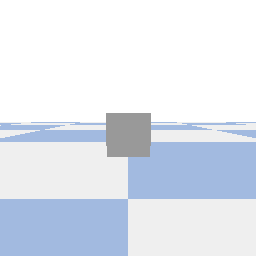
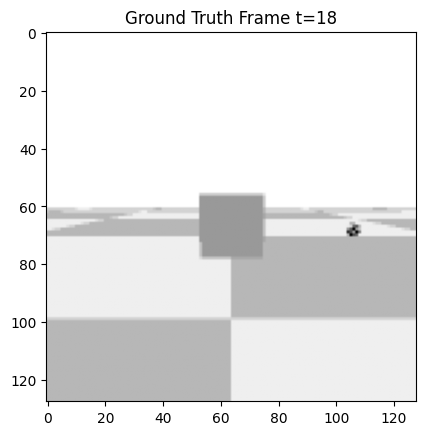
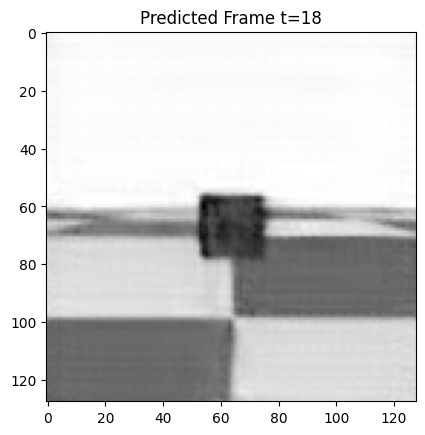

# Predicting Under Occlusion

A set of simple experiments for generating occlusion scenarios using PyBullet and evaluating video prediction models (e.g., PredRNN) on their ability to forecast through visual occlusion.

## Overview

This project consists of three main stages:

1. **Create Dataset**  
   Use PyBullet to simulate a ball rolling behind a visual occluder. Frame-by-frame RGB images are saved alongside per-frame metadata indicating object position, velocity, and occlusion status.

2. **Load Model**  
   Load a pretrained [PredRNN-V2](https://github.com/thuml/predrnn-pytorch) model. Supports different pretraining datasets including MNIST, KTH, and BAIR.

3. **Generate Predictions**  
   Run the model on the occlusion dataset and observe how well it predicts object motion during and after occlusion.

## Example Output

- Simulated occlusion GIFs (ball behind a barrier)
- Frame-by-frame metadata (`frame_data.csv`)
- Predicted frames from the model
- Occlusion interval annotations

### Scene Overview

This is an example of a simulated occlusion scenario generated using PyBullet:



### Ground Truth vs. Prediction (PredRNN)

| Ground Truth                        | Model Prediction                      |
|------------------------------------|---------------------------------------|
|        |  |

## Requirements

- Python 3.8+
- `pybullet`
- `imageio`
- `numpy`
- `PIL`
- `torch`
- `PredRNN` dependencies

Install PyBullet and core libraries with:

```bash
pip install pybullet imageio numpy pillow
